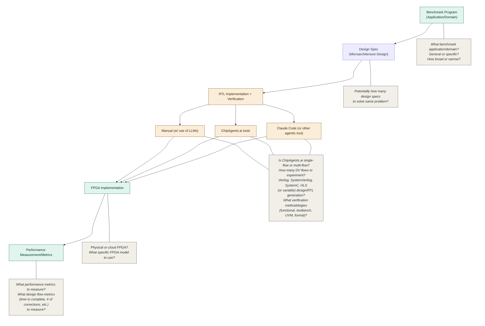

# FPGA Design Flow Workflow

## 1. Benchmark program (constant)

The ML application or domain the benchmark program represents. This anchors the whole workflow — it's the real-world task the design is meant to solve.

**Open questions:**
- What benchmark application/domain?
- How general or specific?
- How broad or narrow?
- How many programs to test/optimize?

## 2. Design spec (potentially variable)

A spec derived from our microarchitectural design for optimizing the chosen benchmark that the RTL implementation must match. There may be more than one valid spec for the same underlying problem.

**Open questions:**
- Potentially, how many design specs to solve the same problem?
- What format should the specs be in?

## 3. RTL implementation + verification (variable)

The core experimental stage. The design spec can be implemented and verified through several different flows:
- **Manual** (with use of LLMs)
- **ChipAgents.ai tools**
- **Claude Code** (or other agentic tool)

Each flow converges back to a common FPGA implementation stage, allowing the flows to be compared against one another.

**Open questions:**
- Is ChipAgents.ai a single-flow or multi-flow tool?
- How many DV flows to experiment with? (Currently 3)
- Verilog, SystemVerilog, SystemC, HLS (or variable) design/RTL generation?
- What verification methodologies (functional, testbench, UVM, formal)?
- What IDE, verification, synthesis tools to use for each flow?

## 4. FPGA implementation (constant)

Taking the verified RTL and implementing it on an FPGA, held constant across the different RTL flows so results are comparable.

**Open questions:**
- Should implementation be on physical or cloud FPGA?
- What specific FPGA model to use?

## 5. Performance measurement/metrics (constant)

Measuring the outcome of the FPGA implementation to evaluate and compare the different upstream RTL flows.

**Open questions:**
- What performance metrics to measure (runtime, throughput, area, power, etc.)?
- What design flow metrics (time to complete, number of corrections, etc.) to measure?
