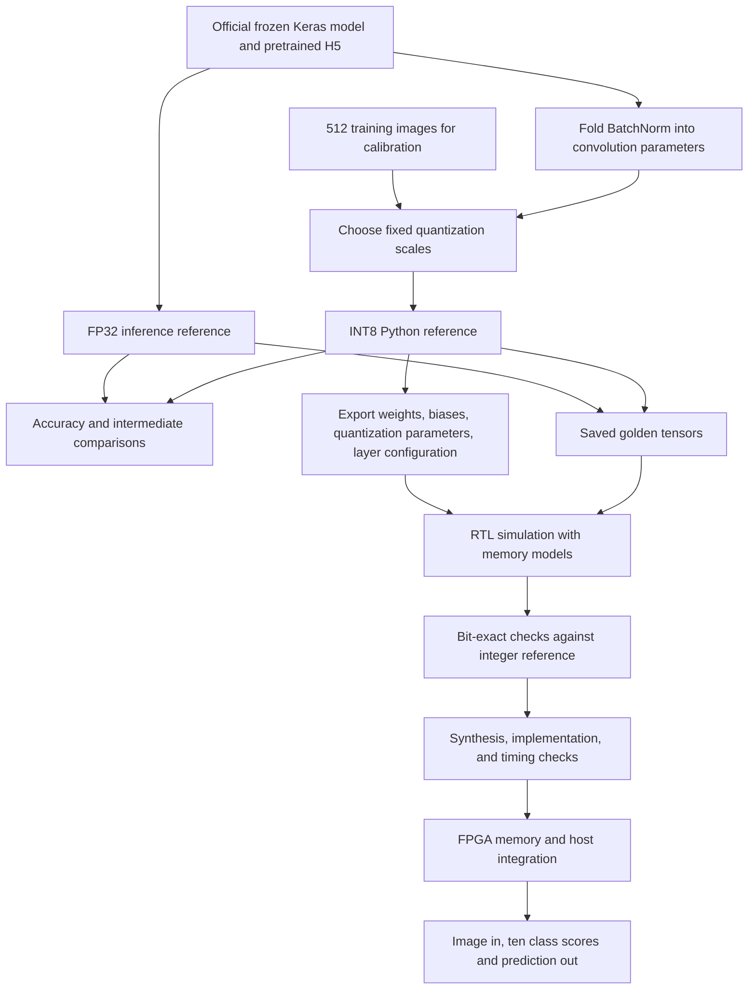

# ResNet-8 FPGA project: team architecture and development flow

Status as of **October 1, 2026**. This is the team entry point. The exact model
specification lives in [ARCHITECTURE.md](ARCHITECTURE.md), and the integer arithmetic
and export format live in [HARDWARE_CONTRACT.md](HARDWARE_CONTRACT.md).

## 1. Goal and current position

Our goal is to classify a **32 x 32 RGB image into one of ten CIFAR-10 classes**
using a ResNet-8 accelerator on the K26/KV260 platform. We first establish correct
software results, then build RTL that reproduces the integer software exactly,
then integrate memory and host control and measure the implemented hardware.

We have a working full-network software reference, an INT8 software model, saved
test vectors, and hardware parameter exports. We also have an experimentally
verified parallel convolution design and a new, much smaller sequential Conv0
design. **We do not yet have a complete ResNet running in hardware.**

| Part | Current status |
|---|---|
| Frozen network and official pretrained weights | Complete |
| FP32 inference and intermediate tensor dumps | Complete |
| INT8 inference, BatchNorm folding, and export | Complete; software checks passed |
| Ten fixed golden images and all intermediate results | Generated |
| Original parallel convolution RTL | Synthetic simulation passed; synthesis exceeds device capacity |
| Single-MAC Conv0 RTL and testbench | User-reported synthetic run passed 79,872 comparisons; Python fixture skipped; synthesis pending |
| 416-MAC Conv0 RTL and testbench | User-reported synthetic run passed 133,120 comparisons; Python fixture skipped; synthesis report pending |
| Programmable convolution, residual, pooling, dense, and board integration | Remaining work |

## 2. The complete flow



**There are two golden references.** FP32 establishes the original neural
network's behavior and accuracy. INT8 establishes the exact arithmetic the RTL
must reproduce. A different FP32 and INT8 score can be a normal quantization
effect. A different RTL and INT8 accumulator for the same operands is a bug.

The Python programs currently run inference on the computer. Selecting
`--integer` runs the integer model in Python; it does not send work to the FPGA.

## 3. Frozen network architecture

A tensor is a multidimensional array. Here, `H x W x C` means height, width, and
channels. The input's three channels are red, green, and blue. Later channels
are learned feature maps, not additional color components.

The model is the MLPerf Tiny function `resnet_v1_eembc(conv_filters=26)` with the
matching official checkpoint [pretrainedResnet26.h5](upstream/pretrainedResnet26.h5).
The other vendored `pretrainedResnet.h5` has incompatible 16/32/64 channel widths
and is retained only for provenance. Do not substitute it.

| Stage | Operation | Output H x W x C | What follows |
|---|---|---|---|
| Input | RGB image | 32 x 32 x 3 | FP32 input pixels are in [0,255] |
| Conv0 | 3 x 3, 3 -> 26, stride 1 | 32 x 32 x 26 | BatchNorm, ReLU |
| Block 1 Conv1 | 3 x 3, 26 -> 26, stride 1 | 32 x 32 x 26 | BatchNorm, ReLU |
| Block 1 Conv2 | 3 x 3, 26 -> 26, stride 1 | 32 x 32 x 26 | BatchNorm |
| Block 1 Add | Add unchanged block input | 32 x 32 x 26 | ReLU |
| Block 2 Conv1 | 3 x 3, 26 -> 52, stride 2 | 16 x 16 x 52 | BatchNorm, ReLU |
| Block 2 Conv2 | 3 x 3, 52 -> 52, stride 1 | 16 x 16 x 52 | BatchNorm |
| Block 2 Shortcut | 1 x 1, 26 -> 52, stride 2 | 16 x 16 x 52 | Add to main path, then ReLU |
| Block 3 Conv1 | 3 x 3, 52 -> 104, stride 2 | 8 x 8 x 104 | BatchNorm, ReLU |
| Block 3 Conv2 | 3 x 3, 104 -> 104, stride 1 | 8 x 8 x 104 | BatchNorm |
| Block 3 Shortcut | 1 x 1, 52 -> 104, stride 2 | 8 x 8 x 104 | Add to main path, then ReLU |
| Average pool | Mean of each channel's 8 x 8 values | 1 x 1 x 104 | Flatten into 104 values |
| Dense | 104 -> 10 | 10 logits | Argmax for class; softmax for displayed scores |

Each residual block has two paths from the **same block input**. The main path
passes through two convolutions. The shortcut either preserves the input
(Block 1) or uses a 1 x 1 convolution to match the new shape (Blocks 2 and 3).
The paths meet in an elementwise addition followed by ReLU.

ReLU replaces negative values with zero. Average pooling computes means.
**This network has no max-pooling layer.** There are nine physical convolutions:
seven on the main path and two shortcut projections. The ResNet-8 name does
not mean that the hardware executes eight convolutions.

The class order is: airplane, automobile, bird, cat, deer, dog, frog, horse,
ship, truck. The network has 205,306 Keras parameters, including BatchNorm
statistics. Preserve the graph, checkpoint, preprocessing, and class order.
Necessary changes require a specification revision and regenerated references.

## 4. Software and hardware arithmetic

### FP32 reference

[fp32.py](fp32.py) builds the supplied Keras graph, loads the matching checkpoint,
and observes intermediate tensors during inference. Input is float32 RGB in
the range 0 to 255: **do not divide pixels by 255** for this model.

### INT8 reference

[integer.py](integer.py) is the main file to study for hardware behavior.
An INT8 value stores a signed integer between -128 and 127. Its real-valued
interpretation is `integer * scale`; all zero points are zero. Activation scales
are per tensor; weight scales are per output channel. Input scale is `255/127`,
so nonnegative RGB pixels become integers from 0 to 127.

The weighted-layer datapath is:

```text
INT8 input x INT8 weight -> signed 16-bit product
                        -> sum products in INT32
                        -> include one INT32 bias per output value
                        -> multiply by integer scale multiplier M in 64 bits
                        -> divide by 2^R with defined rounding
                        -> saturate to INT8; apply ReLU where required
```

A MAC is a multiply-accumulate: `acc = acc + input * weight`. A convolution
output starts with its bias and accumulates every kernel position and input
channel. Conv0 has `3 * 3 * 3 = 27` products per output value. A later 3 x 3
layer with 104 input channels has `3 * 3 * 104 = 936` products per output value.

Rounding is **nearest, with halfway cases away from zero**. Saturation limits
the result to [-128,127], or [0,127] after ReLU. Requantization uses a signed
64-bit intermediate even though the convolution accumulator is INT32.
Exports are checked so valid model accumulations fit INT32. The current RTL
arithmetic itself does not detect overflow; arbitrary overflowing test inputs
would wrap and are outside that exported-model guarantee.

BatchNorm is folded offline into each applicable convolution's weights and
bias. There is no need for a separate BatchNorm hardware block. Shortcut
convolutions have no BatchNorm to fold.

Residual branches can have different scales. Requantize each into the common
output scale, retain wide results, add them, and then apply ReLU and saturation.
Clipping the branches separately before adding can destroy cancellation.
Pooling sums 64 values in INT32 and rounds division by 64. Dense uses the same
integer weighted-sum principle. Integer logits determine the class; floating
point softmax is currently only host-side score presentation.

This is our **custom symmetric INT8 contract**, not a claim of bit-exact
compatibility with a separate TFLite implementation.

### Layout and padding

| Data | Linear element address |
|---|---|
| Activation, one image, HWC | `(y * W + x) * C + c` |
| Convolution weights, OHWI | `((oc * K + ky) * K + kx) * Cin + ic` |
| Dense weights, OI | `oc * Cin + ic` |

Hardware exports use OHWI kernels; original Keras kernels use HWIO. Kernel
elements are not flipped. Out-of-bounds input samples are zero.
TensorFlow SAME padding depends on stride: Conv0 pads one sample on each edge,
but the network's 3 x 3 stride-2 layers pad **top/left 0, bottom/right 1**.
Do not copy Conv0's padding logic unchanged into a programmable engine.

## 5. What the RTL does today

### Original parallel experiment

| File | Function |
|---|---|
| [mac_int8.v](../rtl/mac_int8.v) | One signed INT8 multiply with an INT32 accumulator; reset, bias-load, and enable controls |
| [pixel.v](../rtl/pixel.v) | 27 MAC instances plus a reduction tree for one 3 x 3 RGB dot product; counts bias once |
| [conv_1024_pixels.v](../rtl/conv_1024_pixels.v) | 1,024 pixel instances for all spatial positions of **one output channel** |
| [tb_conv_1024.sv](../rtl/tb_conv_1024.sv) | Self-checking testbench for that parallel interface |

The top instantiates `1024 * 27 = 27,648` MACs. It exposes the whole image and
output plane on wide ports. It computes raw convolution-plus-bias INT32 values;
it does not compute all 26 channels, requantize, or execute the full network.

The user-provided Vivado run passed **904,229 comparisons over 442 cycles**,
including 64 seeded random cases, reset/control tests, padding, signed boundary
values, and ordering checks. Its optional Python fixture was **skipped**:
`python_fixture=0`. This proves the exercised synthetic tests passed; it does
not establish a comparison against the exported pretrained Conv0 fixture.

The reported 58 minutes was mainly **elaboration**, when XSim built the large
design snapshot: 58 minutes 14 seconds. XSim took about 25 seconds for its
simulation stage; total launch time was 58 minutes 41 seconds. These wall-clock
tool times do not measure FPGA inference latency.

The supplied synthesis report for `conv_1024_pixels` targeting
`xck26-sfvc784-2LV-c` showed:

| Resource | Used | Available | Utilization |
|---|---:|---:|---:|
| LUTs | 2,916,423 | 117,120 | 2,490.12% |
| Registers | 850,272 | 234,240 | 362.99% |
| DSPs | 0 | 1,248 | 0% |
| Bonded I/O | 57,596 | 189 | 30,474.07% |

This netlist cannot fit the target. Completing synthesis does not mean a
design can be placed, routed, or run on the board.

### Current direction: reuse one arithmetic datapath

[conv0_serial_dsp.v](../rtl/conv0_serial_dsp.v) is a standalone engine with one
signed 8 x 8 multiplier and one INT32 accumulator. It does not instantiate the
old `pixel` or `conv_1024_pixels` modules. A controller reuses the datapath across
kernel taps, spatial positions, and all 26 Conv0 output channels.

```text
External image memory ----\
                          captured operands -> shared multiplier -> accumulator
External weight memory --/                                            ^
External bias memory --------------------- load bias per output --------|
                                                                     |
FSM and address counters control reads                  INT32 output handshake
```

| Interface | Meaning |
|---|---|
| `clk`, `rst` | Clock and synchronous active-high reset |
| `start`, `busy`, `done` | Pulse start while idle; busy during work; done pulses after final output acceptance |
| `image_*` | Read 3,072 signed INT8 HWC input values |
| `weight_*` | Read 702 signed INT8 OHWI weights |
| `bias_*` | Read 26 signed INT32 biases |
| `out_valid`, `out_ready`, `out_addr`, `out_data` | Transfer 26,624 addressed INT32 results |

For each read port, the engine holds `req` and address until a rising edge with
`ready`. Memory returns the corresponding data with `valid`, either on that
edge or later. There is only one outstanding read across the engine. Output
data and address remain stable while `out_valid` is high and `out_ready` is low.

The engine fetches each channel's bias once, then reloads it into the accumulator
for each output position. It accumulates the 27 terms, emits the result, and
moves on. Padding taps use zero and skip memory reads.

Output addresses describe HWC storage, but **emission is channel by channel**:
channel 0 writes addresses `0, 26, 52, ...`; channel 1 starts at address 1.
Consumers and scoreboards must use `out_addr`, not assume consecutive addresses.

One image requires **718,848 MAC steps** (`32 * 32 * 26 * 27`). This is not the
clock count: setup, memory handshakes, counter updates, and output handshakes
take additional cycles. Clock frequency and inference latency are not measured.

The `use_dsp="yes"` attribute requests DSP mapping for the multiplier. Actual
DSP use and whether the accumulator also maps into a DSP must be confirmed by
synthesis. ReLU is compare/select logic; it is not the reason to reserve DSPs.
Convolution and dense arithmetic are the main multiplication workloads.

The subsequent user-reported simulation passed three synthetic frames and
79,872 comparisons in a 40-second overall launch. The Python fixture was skipped,
and synthesis results remain pending. Its memories are
external interfaces, not implemented BRAMs. It is fixed to Conv0 and emits raw
INT32 accumulators. Requantization and ReLU must be added before its results can
feed the next INT8 layer. One shared datapath is an initial area baseline;
the final number of parallel lanes should follow measured resource, memory,
and throughput requirements.

## 6. Exported data and verification assets

[export_model.py](../export_model.py) and [export.py](export.py) bridge software
to hardware: checkpoint -> BN folding -> quantization -> memory layout -> files.

| Export | Contents |
|---|---|
| `weights.bin` | INT8 convolution and dense weights |
| `biases.bin` | INT32 biases |
| `quant_params.bin` | Integer multiplier/shift pairs |
| `layer_config.bin` | Fourteen operation records describing the graph |
| `manifest.json` | Shapes, scales, offsets, hashes, and provenance |
| Per-layer `.mem` files | Hex words for simulation memory loading |

Binary words are little-endian; `.mem` files contain one hex word per line.
The current Conv0 module does not parse the configuration stream. That belongs
to the future programmable controller.

For the new full-Conv0 testbench, use these files under `resnet8/artifacts/`:

| File | Elements | Purpose |
|---|---:|---|
| `layer_vectors/conv0/input.mem` | 3,072 | INT8 input memory |
| `export/conv0_weights.mem` | 702 | INT8 weight memory |
| `export/conv0_bias.mem` | 26 | INT32 bias memory |
| `layer_vectors/conv0/expected_acc.mem` | 26,624 | Expected current RTL output |
| `layer_vectors/conv0/expected_output.mem` | 26,624 | Expected INT8 output after future requantization/ReLU |

The separate `conv_fixture/` directory covers **only one output channel** and
was intended for the smaller first-convolution test. Do not use its 1,024-result
expectation as the complete answer for the new 26-channel engine.

The software baseline used the first 512 training images for calibration and
the first 1,000 test images for evaluation:

| Measurement | Result |
|---|---:|
| FP32 accuracy | 89.2% |
| INT8 accuracy | 87.9% |
| Accuracy drop | 1.3 percentage points |
| FP32/INT8 prediction agreement | 94.9% |
| Integer arithmetic unit tests | 9 passed |

All saved integer golden tensors match after binary export reload. The golden
set contains ten fixed images, one per true class, with original inputs,
intermediates, predictions, and parameter identities. These are software
measurements, not full-test-set or hardware accuracy results. See
[RESULTS.md](RESULTS.md) and [verification_baseline.json](verification_baseline.json).

## 7. Remaining work and acceptance gates

| Next step | Required result before moving on |
|---|---|
| Run the supplied new Conv0 testbench | Exercise the three memory models, immediate/delayed responses, request stalls, output stalls, reset, restart, and completion |
| Verify the sequential core | Every one of 26,624 accepted addressed outputs matches the integer accumulator; no missing or duplicate writes; done follows the final accepted output |
| Synthesize the sequential core | Record actual LUT/register/DSP use and inspect inferred arithmetic; confirm resource reduction |
| Add requantization and ReLU | Conv0 INT8 outputs match `expected_output.mem`, including signed rounding and saturation tests |
| Generalize convolution | All nine layer fixtures pass with kernels 1/3, strides 1/2, required channels/shapes, correct SAME padding, and ReLU control |
| Add remaining operators | Residual scale alignment/add, average pool, and dense match integer intermediate tensors |
| Add memory and graph scheduling | Preserve residual inputs, execute dependencies correctly, and match all ten golden network runs |
| Integrate host and board | Load an image and parameters, start inference, retrieve results, close timing, and measure latency/resources |

The intended full accelerator will have activation and parameter storage,
a configurable convolution datapath, requantization/ReLU, residual processing,
pooling, dense processing, and a controller. The implementation may share
arithmetic between operations. Buffer allocation, memory banking, lane count,
host transport, AXI/DMA integration, and target throughput are still design
decisions, not completed features.

Residual scheduling needs special care: keep each block input alive until
both the main and shortcut paths have consumed it. A correct individual
convolution is insufficient if later writes overwrite a still-needed tensor.

Suggested team workstreams are reference/export maintenance, RTL datapath and
control, simulation/scoreboards, and memory/board integration. All workstreams
should use the same frozen checkpoint, export manifest, layouts, and arithmetic
contract. Record the tested design top, fixture identity, and tool results for
each milestone so evidence from the old core is not attributed to the new one.

## 8. Run the software and find the code

From the repository root in PowerShell, using the existing environment:

```powershell
cd resnet8_project

# Original FP32 reference
..\.venv-resnet\Scripts\python.exe run_resnet.py resnet8/artifacts/golden/00000_cat/input.png

# Integer hardware reference, still running on the computer
..\.venv-resnet\Scripts\python.exe run_resnet.py resnet8/artifacts/golden/00000_cat/input.png --integer

# Check saved golden tensors and exported parameters
..\.venv-resnet\Scripts\python.exe verify_resnet.py

# Arithmetic unit tests
..\.venv-resnet\Scripts\python.exe -m unittest discover -s tests -v
```

Both inference commands print ten class scores and a prediction, and save
tensors plus `prediction.json` under `resnet8/artifacts/inference/` by default.
Input images must be 32 x 32; the loader converts them to RGB and rejects other
dimensions. Generated artifacts are ignored by Git. A new checkout needs the
setup/generation steps in [README.md](README.md) before these fixture-based runs.

| File or document | Start here for |
|---|---|
| [run_resnet.py](../run_resnet.py) | Inference command and result saving |
| [prepare_resnet.py](../prepare_resnet.py) | Dataset, calibration, evaluation, and golden generation |
| [integer.py](integer.py) | Whole-network INT8 execution and arithmetic |
| [fp32.py](fp32.py) | Original model loading and observed tensors |
| [export.py](export.py) | Export encoding and reload validation |
| [ARCHITECTURE.md](ARCHITECTURE.md) | Exact frozen network and checkpoint hashes |
| [HARDWARE_CONTRACT.md](HARDWARE_CONTRACT.md) | Numerical rules, addresses, and configuration records |
| [RESOURCE_REUSE.md](../rtl/RESOURCE_REUSE.md) | New Conv0 engine and memory protocol |
| [SIMULATION.md](../rtl/SIMULATION.md) | Existing **parallel-core** testbench instructions |

The old `setup_xsim_no_waves.tcl` selects `tb_conv_1024`. For `conv0_serial_dsp`,
use the new `tb_conv0_serial_dsp.sv` and `setup_xsim_serial.tcl`; see
[SERIAL_SIMULATION.md](../rtl/SERIAL_SIMULATION.md).

For the subsequent 416-MAC design, use `conv0_416_dsp.v`, `tb_conv0_416_dsp.sv`,
and `setup_xsim_416.tcl`. [CONV0_416.md](../rtl/CONV0_416.md) describes its 16-spatial
by 26-channel compute structure, replicated image memories, preload interface,
and four-result output beats. The user-reported run passed five synthetic frames
and 133,120 comparisons, with the Python fixture skipped. Synthesis results and
implemented timing remain pending. See [PROGRESS_UPDATE.md](../PROGRESS_UPDATE.md)
for the team's Conv0-first milestone and [reports/](../reports/README.md) for
CPU timing and the reported RTL evidence.
